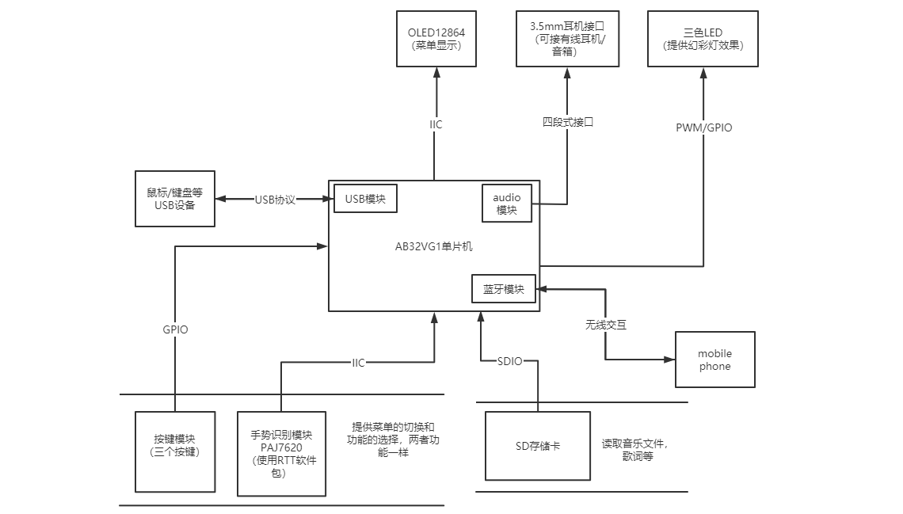

# MusicPlayerBasedOnGestureRecognition
使用 RT-Thread 操作系统和中科蓝讯的 AB32VG1 开发板，配合其他的模块，打造一款手势识别控制的音乐播放器

## 一、概述

本项目是基于实时操作系统 `RT-Thread` 和 `AB32VG1V2.0`的核心板实现的音乐播放器模块，下面是目前规划的系统框图：

下面是实现的功能（其中打勾的为已经实现的功能）：

- [ ] 按键控制
- [ ] 音乐播放
- [ ] SD 卡音乐读取
- [ ] OLED 屏幕菜单显示
- [ ] 三色LED灯效果
- [ ] 手势识别控制

开发环境：

- RT-Thread 版本 latest(2021-10-20)

- RT-Thread Studio版本  V2.12
- AB32VG1 开发板 BSP 版本 V1.08

## 二、模块使用与配置

### 2.1、按键模块

按键模块使用如下 GPIO 引脚：

- S2 -- PF1
- S3 -- PF0
- S4 -- PA2

- OLED12864 模块（IIC 协议）

  - SDA --  PA1
  - SCL --  PA0

- SD 卡模块（SDIO协议）

  - SD_CMD -- PB0

  - SD_CLK -- PB1

  - SD_DAT -- PB2

  - SD_DET -- PE5

  
